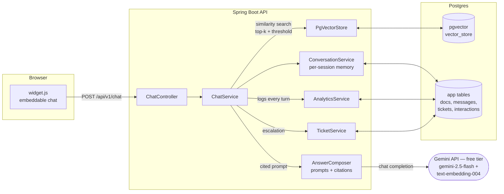

# DocPilot — RAG Support Chatbot Demo

A working AI support agent trained on a business's own documents, with a chat widget
any site can embed in two lines of code. Built with **Spring Boot 3 + Spring AI (Java)** —
most RAG demos are Python; this one is production-grade Java — **PostgreSQL + pgvector**
for embeddings, and the **Gemini free-tier API** for embeddings + chat
(`gemini-2.5-flash` for chat, `text-embedding-004` for embeddings). One free API key,
no card required — so the demo runs on a tiny free host instead of a GPU box.

This is the live demo of the **AI Support Agent package** ($2,500–$6,000): a RAG chatbot
trained on a client's help center, embedded on their site in 2–3 weeks.

## Architecture



**Request flow:** question → embed → pgvector similarity search (top-k, cosine threshold —
tuned per embedding model, see Configuration) → if nothing clears the threshold,
**escalate** (no LLM call, no guessing — offer a support ticket) → otherwise build a
citation-enforcing prompt with conversation history → chat model → answer with `[n]`
citations → persist turn + log interaction for analytics.

## Quickstart — 3 commands

Prerequisites: JDK 21, Maven 3.9+, Docker, and a **free Gemini API key** from
[AI Studio](https://aistudio.google.com) (self-serve, no card required — 250
`gemini-2.5-flash` requests/day on the free tier as of 2026-09).

```bash
docker compose up -d                     # 1. Postgres 17 + pgvector
export GEMINI_API_KEY=<your-key>        # 2. free API key (never commit it)
mvn spring-boot:run                      # 3. API on http://localhost:8080
```

Chat calls return **503** with a clear message until `GEMINI_API_KEY` is set.

On first boot the app seeds a fictional ParcelPilot help center (3 docs) so the bot
answers immediately. Then open the demo storefront: **http://localhost:8080/demo/** —
the chat widget (bottom-right) is live.

> No Maven wrapper is committed; run `mvn wrapper:wrapper` once if you want `./mvnw`.

## Demo script (60 seconds)

1. **Cited answer:** "How long do refunds take after my claim is approved?"
   → answers *5–10 business days* with `[1]` citing `refunds.md`.
2. **Conversation memory:** "And what about express shipping?"
   → resolves against prior context, cites `shipping.md`.
3. **The guardrail:** "Do you offer pet insurance?"
   → *"I couldn't find that in the documentation…"* + a one-click **support ticket** form.
   No hallucination — this is the feature buyers care about most.
4. **Admin view:** `GET /api/v1/admin/analytics` → answer rate, escalation rate, avg
   latency, top questions, thumbs up/down counts.

Record this as a GIF/video for the portfolio: 3 questions, citations visible, one
out-of-scope question triggering the guardrail.

## Embed it on a client site

```html
<script src="https://YOUR-DOCPILOT-HOST/widget/widget.js"
        data-api-url="https://YOUR-DOCPILOT-HOST"
        data-title="Acme Support"></script>
```

Dependency-free vanilla JS (~230 lines): floating launcher, cited answers, thumbs
up/down feedback, escalation-to-ticket form. See `src/main/resources/static/widget/embed-snippet.html`.

## API reference

| Method | Path | Description |
|--------|------|-------------|
| POST | `/api/v1/chat` | Ask a question → answer + citations, or escalation + ticket draft |
| GET | `/api/v1/chat/{sessionId}/history` | Session message history |
| POST | `/api/v1/chat/feedback` | Thumbs up/down on an answer (`interactionId`, `helpful`) |
| POST | `/api/v1/documents` | Upload `.pdf`/`.md`/`.txt` (multipart `file`) → chunked + embedded |
| GET | `/api/v1/documents` | List ingested source documents |
| DELETE | `/api/v1/documents/{id}` | Delete doc + exactly its vector chunks |
| POST | `/api/v1/tickets` | Open a support ticket |
| GET | `/api/v1/tickets[?status=]` | List tickets |
| PATCH | `/api/v1/tickets/{id}/status` | `OPEN` → `IN_PROGRESS` → `RESOLVED` |
| GET | `/api/v1/admin/analytics` | Answer/escalation rates, latency, feedback, top questions |
| GET | `/actuator/health` | Liveness (includes DB) |

## Performance targets

> **All numbers below are ILLUSTRATIVE of this demo setup, not client
> benchmarks.** They depend on the model, network, document set, and thresholds.
> Measure your own with `eval/eval.py` (15 starter questions; extend to 50).

| Metric | Illustrative target |
|--------|---------------------|
| p95 answer latency | < 2.5 s |
| Retrieval precision on eval set | > 85% |
| Cost per conversation | ~$0 (Gemini free tier — 250 flash requests/day; a shared/crawled public URL can burn it — flash-lite at 1,000/day is the fallback) |
| Escalation on out-of-scope questions | 100% (by design — never guess) |

### Measured on the demo setup

> ⚠️ The figures below were measured on the **local-Ollama build** (`main` branch:
> llama3.2:3b + nomic-embed-text, 2026-09-20). They do **not** apply to this Gemini
> build — different models, different embedding space. Re-run the eval on this build
> and replace them before quoting any numbers (see "Re-tuning the similarity threshold"
> and "Re-running the eval" below).

Full-stack eval (`eval/eval.py`, 15 questions: 10 in-scope, 5 out-of-scope), app
running with llama3.2:3b + nomic-embed-text, section-aware Markdown chunking,
similarity threshold 0.68:

| Metric | Measured |
|--------|----------|
| Eval behaviors as expected | **15/15** |
| In-scope questions answered with citations | 10/10 |
| Out-of-scope questions escalated | 5/5 (100%) |
| Average answer latency | 5,446 ms |
| p95 answer latency | 23,340 ms (**missed the < 2.5 s target** — the runner is CPU-only; a GPU host or a faster model brings this down) |

Caveat: the harness checks *escalation behavior* and citation presence, not
factual answer quality — verify answers against your own documents before
quoting figures to anyone.

Run the eval: `python3 eval/eval.py` (from `eval/`, app running).

### Re-tuning the similarity threshold (required after the embedding swap)

The threshold is embedding-model-specific. The old 0.68 was hand-tuned for
nomic-embed-text (in-scope 0.70–0.87 vs out-of-scope 0.53–0.65) and is invalid
for `text-embedding-004`. The current 0.70 default is an **untuned placeholder**
that errs toward escalation (the safe failure mode for a support bot). Re-tune
with the app running and `GEMINI_API_KEY` set:

1. Set `docpilot.retrieval.similarity-threshold: 0.0` in `application.yml` and
   restart — retrieval then returns its top-k hits regardless of score.
2. Ask each question in `eval/eval-questions.jsonl` via `POST /api/v1/chat` and
   note the `confidence` field in each response (it's the top-1 cosine similarity).
3. Find the separation band: the highest out-of-scope `confidence` vs the lowest
   in-scope `confidence`. Set the threshold in the middle of that band.
4. Restore the threshold, restart, and run `python3 eval/eval.py` — all 15
   behaviors should pass.

### Re-ingesting after the embedding swap

Changing the embedding model changes the embedding space, so **every stored
vector must be regenerated**. `text-embedding-004` is natively 768 dims, matching
the existing `vector_store` schema — no migration needed — but the vectors
themselves are stale. Cleanest path (sample docs re-seed on boot when the tables
are empty):

```bash
docker compose down -v          # wipe the pgdata volume (deletes old vectors)
docker compose up -d
export GEMINI_API_KEY=<your-key>
mvn spring-boot:run              # wait for "Seeded 3 sample documents"
```

For user-uploaded documents, re-upload them via `POST /api/v1/documents`
(the old chunks are deleted with the volume wipe; or `DELETE
/api/v1/documents/{id}` per doc and re-upload without the wipe).

## For a business like yours

> **Illustrative example, not a promise:** a 500-ticket/month support queue at
> ~4 min/ticket ≈ 33 hrs/month of agent time. If the bot deflects 40% of routine
> questions, that's ~13 hrs/month back — against a one-time $2,500–$6,000 build.
> Real deflection depends on doc quality and question mix; the analytics endpoint
> exists precisely to measure it after launch.

## Honest limits

What this demo does **not** do (and says so to buyers):

- **No authenticated data access** — it answers from uploaded docs only. It cannot
  look up *your* order, *your* account, or anything behind a login. Per-customer
  data requires an integration project, not this package.
- **No multi-language support yet** — English docs in, English answers out.
- **No human handoff / live chat** — escalation creates a ticket; there is no
  agent-takeover queue.
- **Single tenant** — one knowledge base per deployment. Multi-tenant isolation
  is a separate architecture discussion.
- **PDF parsing is basic** — scanned/image PDFs (no text layer) need OCR first.

## What's real vs. stubbed

**Real:** document ingestion (PDF/md/txt → chunking → Gemini embeddings → pgvector),
vector retrieval with similarity threshold, citation-enforcing prompts, conversation
memory, the escalate-to-ticket guardrail, feedback, analytics, the embeddable widget.

**Stubbed / simplified for demo purposes:**
- `ddl-auto: update` instead of Flyway/Liquibase migrations (switch before production).
- Tickets are stored locally — a client deployment forwards to Zendesk/Intercom/Freshdesk.
- CORS is wide open for the widget demo — lock to explicit origins in production.
- No auth on the API — add Spring Security (API keys / OAuth2) per client.
- No rate limiting — add bucket4j/Resilience4j before exposing publicly.
- Sample docs are fictional (ParcelPilot) — replace with the client's help center.

## Configuration

All tuning lives in `src/main/resources/application.yml`:

| Key | Default | Notes |
|-----|---------|-------|
| `GEMINI_API_KEY` (env) | *(required)* | Chat calls return 503 with a clear message until set. Free key at https://aistudio.google.com |
| `spring.ai.google.genai.chat.options.model` | `gemini-2.5-flash` | `gemini-2.5-flash-lite` is the 1,000-request/day fallback if the free quota binds |
| `spring.ai.google.genai.embedding.text.options.model` | `text-embedding-004` | 768 dims — matches the pgvector schema. Changing the embedding model requires re-ingesting all documents (different embedding space) |
| `docpilot.retrieval.top-k` | `5` | Chunks per question |
| `docpilot.retrieval.similarity-threshold` | `0.70` (UNTUNED placeholder) | Below this → escalate instead of answering. The old 0.68 was hand-tuned for nomic-embed-text and is invalid for `text-embedding-004` — re-tune before quoting accuracy figures (see "Re-tuning the similarity threshold"). Docs are chunked by Markdown section headings at ingest; the chat prompt also carries a no-answer sentinel so the model declines when chunks don't actually answer the question |
| `docpilot.chat.history-window` | `8` | Prior messages included as context |

## Project structure

```
src/main/java/dev/vishalbhardwaj/docpilot/
├── DocPilotApplication.java
├── config/          # DocPilotProperties (tuning knobs), WebConfig (demo CORS)
├── common/          # ApiError, GlobalExceptionHandler, ApiKeyMissingException
├── ingest/          # upload → chunk → embed → pgvector; sample-data seeder
├── chat/            # RAG pipeline, AnswerComposer (prompts/citations),
│                    # conversation memory, interaction logging, feedback
├── ticket/          # support tickets — the guardrail made concrete
└── analytics/       # answer/escalation rates, latency, top questions
src/main/resources/
├── application.yml
├── sample-docs/     # fictional ParcelPilot help center (seeded on first boot)
├── static/widget/   # widget.js + embed-snippet.html
└── static/demo/     # sample storefront with the live widget
eval/                # eval.py + eval-questions.jsonl (illustrative harness)
```
